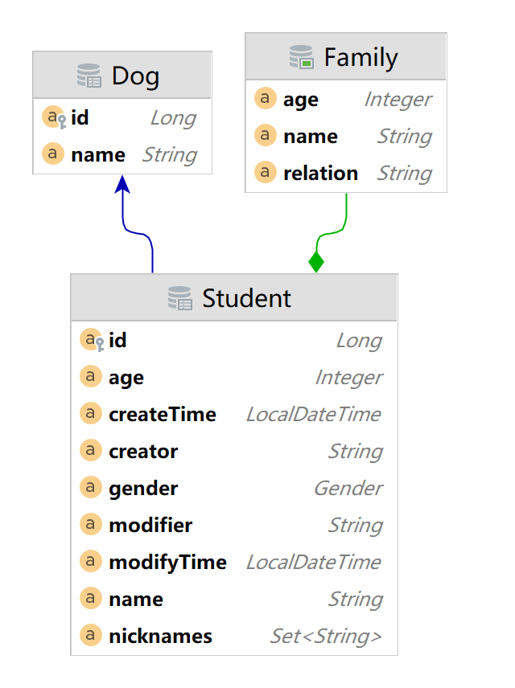

= spring-data-jpa-sample

sample code for https://pxzxj.github.io/articles/why-use-jpa.html[why use jpa]

== Introduction

* Spring Boot 2.7.18
* Spring Data JPA 2.7.18
* H2
* Username/Password  admin/123456

== QuickStart

* Student
* StudentRepository

== Entity

* @Entity、@Table、@Column
* Boolean
* LocalDateTime
* @Enumerated
* @Transient
* @ElementCollection
* @CreatedBy、@CreatedDate、@LastModifiedBy、@LastModifiedDate

== Repository

[horizontal]
CrudRepository   ::  基础CRUD
PagingAndSortingRepository   ::  分页查询
JpaSpecificationExecutor   ::   动态条件查询

=== Relationship

* @OneToMany、@ManyToOne、@OneToOne、@ManyToMany
* @JoinColumn
* @JoinTable
* Bidirectional、Unidirectional
* FetchType
* CascadeType
* 不一定非要对象关联，有时直接使用关联的列更简，典型的如操作日志

== CRUD

* save(Create/Update)
* find
* delete

== Query

=== Basic

* findById
* existsById
* findAll
* findAllById
* count
* findAll(Sort sort);
* findAll(Pageable pageable);
* findAll(@Nullable Specification<T> spec, Pageable pageable);

=== https://docs.spring.io/spring-data/jpa/docs/2.7.x/reference/html/#repositories.query-methods.details[Query Method]

https://docs.spring.io/spring-data/jpa/docs/2.7.x/reference/html/#jpa.query-methods

=== @Query

* 并发更新不同的字段

== How-To

=== configuration

[source,yaml,subs="verbatim"]
----
spring:
  jpa:
    hibernate:
      ddl-auto: none                          #  <1>
    properties:
      hibernate:
        show_sql: true                        #  <2>
        use_sql_comments: true
        format_sql: true
      javax:
        persistence:
          validation:
            mode: none                        #  <3>
----
1. 不自动建表
2. 控制台展示执行的sql
3. 关闭Bean Validation校验

=== https://docs.spring.io/spring-data/jpa/docs/2.7.x/reference/html/#auditing[Audit]

* @EnableJpaAuditing
* AuditorAware Bean
* @EntityListeners(AuditingEntityListener.class)
* @CreatedBy、@CreatedDate、@LastModifiedBy、@LastModifiedDate

=== https://docs.spring.io/spring-data/jpa/docs/2.7.x/reference/html/#core.web.basic.paging-and-sorting[Pageable & Spring MVC]

=== Lazy Fetch & Transaction

=== Optimistic Locking

* `@Version`

=== Test

* @DataJpaTest
* schema.sql、data.sql